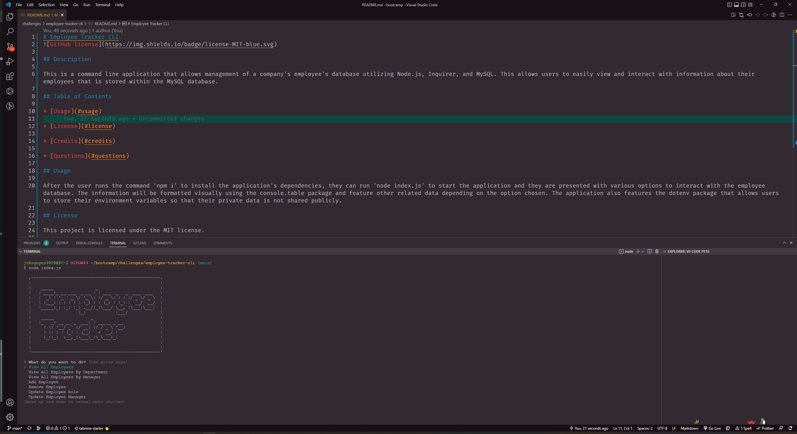
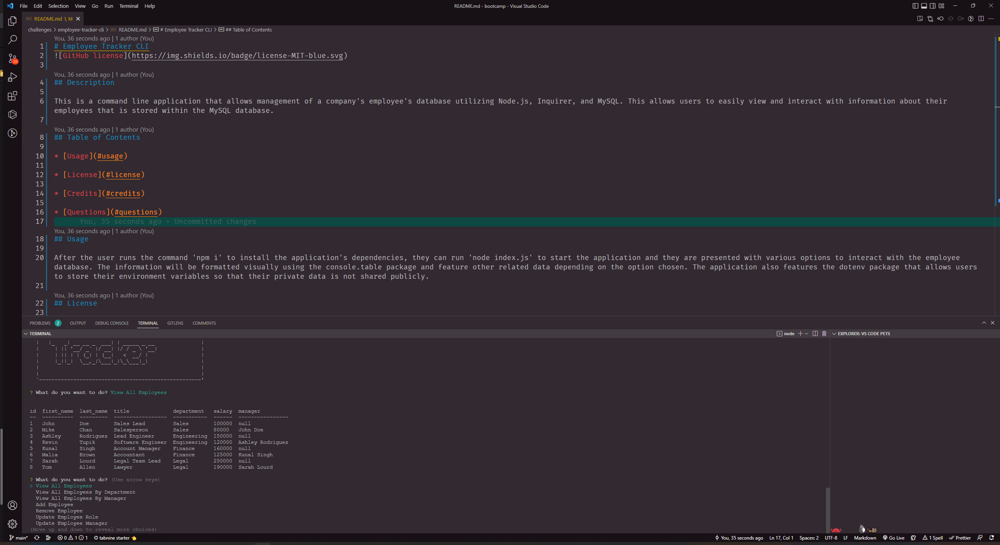

# Employee Tracker CLI

## Description

This is a command line application that allows management of a company's employee's database utilizing Node.js, Inquirer, and MySQL. This allows users to easily view and interact with information about their employees that is stored within the MySQL database.

## Table of Contents

* [Usage](#usage)

* [License](#license)

* [Credits](#credits)

* [Questions](#questions)

## Usage

After the user runs the command 'npm i' to install the application's dependencies, they can run 'node index.js' to start the application and they are presented with various options to interact with the employee database. The information will be formatted visually using the console.table package and feature other related data depending on the option chosen. The application also features the dotenv package that allows users to store their environment variables so that their private data is not shared publicly.

## License

This project is licensed under the MIT license.

## Credits

Inquirer

MySQL2

dotenv

## Questions

If you have any questions about this repository, open an issue or contact me at jthnguyen9909@gmail.com. You can find more of my work at [jthnguyen9909](https://github.com/jthnguyen9909).
